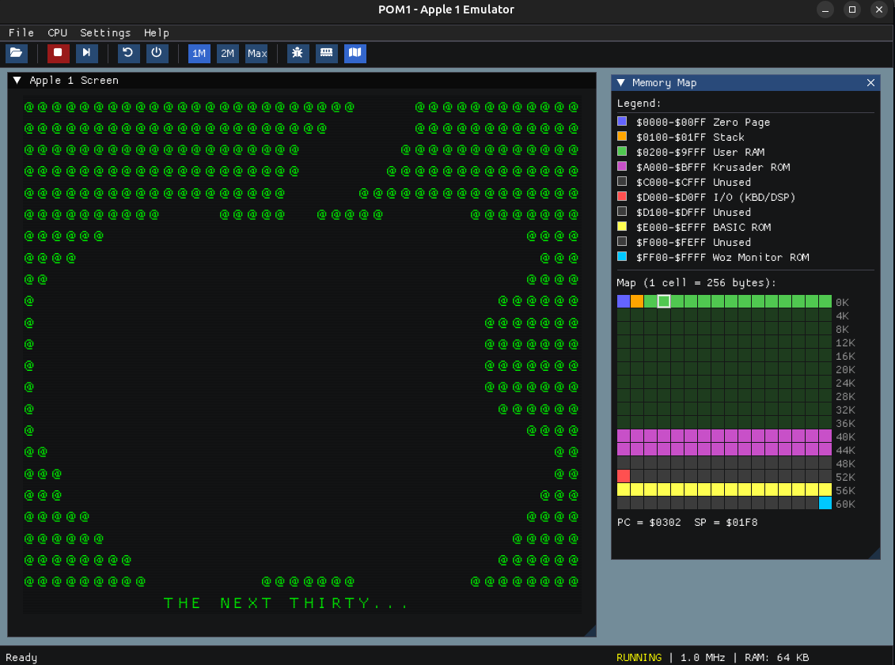

<div align="center">

# 🍎 POM1 v1.2 — Apple 1 Emulator

**Experience the machine that started the personal computer revolution.**

🎂 **Celebrating 50 years of Apple (1976–2026)** — POM1 v1.2 is released in honor of the 50th anniversary of Apple Computer, founded on 1976.

A faithful Apple 1 emulator built with Dear ImGui & OpenGL — fast, lightweight, and cross-platform. Now with Uncle Bernie's GEN2 Color Graphics Card support.

**Play it now in your browser** : 
[](https://habib256.github.io/POM1/build-wasm/pom1_imgui.html)

or build it natively.

[](LICENSE)
[](#-quick-start)
[](#)




</div>

---

## ✨ Features

🖥️ **Authentic Apple 1 Display** — 40×24 character grid, `charmap.rom` bitmap or host ASCII, green / brown / monochrome CRT with scanlines and glow, blinking `@` cursor

⚙️ **Cycle-Accurate 6502 CPU** — All official opcodes, all addressing modes, adjustable clock (1 MHz / 2 MHz / Max)

🔍 **Live Memory Editor** — Interactive hex viewer with color-coded regions, search, bookmarks, and real-time editing

🗺️ **Visual Memory Map** — Color-coded 64 KB overview with region legend, PC/SP indicators, and tooltips

📂 **Program Loader** — Load binary files or Woz Monitor hex dumps (with inline comment support) via a built-in file browser

📼 **Apple Cassette Interface (ACI)** — Woz ACI ROM at `$C100`, cassette input on `$C081`, output flip-flop on `$C000`, real-time audio (desktop & WebAssembly), and tape import/export as `.aci` or `.wav`

🔌 **PIA 6821 Address Aliasing** — Full support for `$D0Fx` aliases, enabling all known Apple BASIC versions (original, Pagetable, Briel/Replica 1)

🐛 **Step Debugger** — Single-step execution, register inspection, disassembly, stack view, log console

💾 **Memory Save/Export** — Save any memory range as binary or Woz Monitor hex dump

🎨 **GEN2 Color Graphics Card** — [Uncle Bernie's HIRES color graphics card](https://www.applefritter.com/content/uncle-bernies-gen2-color-graphics-card-apple-1) — 280×192 resolution with NTSC artifact color (violet, green, blue, orange), pixel glow, rendered in a separate window from `$2000-$3FFF` RAM

📋 **Clipboard Paste** — Paste code directly into the Apple 1 keyboard from your clipboard

🎮 **30+ Programs Included** — Games, demos, BASIC programs, and dev tools ready to run out of the box

---

## 🚀 Quick Start

### 🐧 Linux / 🍏 macOS

```bash
git clone https://github.com/gistarcade/POM1.git
cd POM1
./setup_imgui.sh                    # fetch Dear ImGui + install deps (one-time)
cd build && cmake .. && make
cd .. && ./run_emulator.sh          # copies ROMs & launches the emulator
```

### 🪟 Windows

**Prerequisites:** [Visual Studio](https://visualstudio.microsoft.com/) (C++ workload), [CMake](https://cmake.org/download/), [Git](https://git-scm.com/download/win), [vcpkg](https://vcpkg.io/)

```batch
git clone https://github.com/gistarcade/POM1.git
cd POM1
setup_imgui.bat                     REM fetch Dear ImGui + install GLFW via vcpkg
cd build
cmake --build . --config Release
cd ..
run_emulator.bat                    REM copies ROMs & launches the emulator
```

### 🌐 Web Version (WebAssembly)

**Play directly in your browser:** [https://habib256.github.io/POM1/build-wasm/pom1_imgui.html](https://habib256.github.io/POM1/build-wasm/pom1_imgui.html)

To build the WASM version yourself:

```bash
# Install Emscripten (one-time)
git clone https://github.com/emscripten-core/emsdk.git
cd emsdk && ./emsdk install latest && ./emsdk activate latest && source ./emsdk_env.sh && cd ..

# Build
cd POM1
mkdir -p build-wasm && cd build-wasm
emcmake cmake ..
emmake make -j$(nproc)

# Test locally
emrun pom1_imgui.html
```

### 📦 Manual dependency install

<details>
<summary>Ubuntu / Debian</summary>

```bash
sudo apt install cmake libglfw3-dev libgl1-mesa-dev pkg-config
```
</details>

<details>
<summary>Fedora</summary>

```bash
sudo dnf install cmake glfw-devel mesa-libGL-devel pkgconf
```
</details>

<details>
<summary>Arch</summary>

```bash
sudo pacman -S cmake glfw mesa pkgconf
```
</details>

<details>
<summary>macOS</summary>

```bash
brew install cmake glfw pkg-config
```
</details>

<details>
<summary>Windows (vcpkg)</summary>

```batch
vcpkg install glfw3:x64-windows
```
</details>

---

## ⌨️ Keyboard Shortcuts

| Shortcut | Action |
|----------|--------|
| `F1` | Toggle Memory Viewer |
| `F2` | Toggle Memory Map |
| `F3` | Toggle Debug Console |
| `F5` | Soft Reset |
| `Ctrl+F5` | Hard Reset |
| `F6` | Start / Stop CPU |
| `F7` | Step (single instruction) |
| `Ctrl+O` | Load program |
| `Ctrl+S` | Save memory |
| `Ctrl+V` | Paste code |

---

## 📼 Cassette Interface

The emulator now includes the **Apple Cassette Interface (ACI)**:

- start the cassette monitor with `C100R`
- load a tape image from **File > Load Tape**
- export the last captured cassette signal from **File > Save Tape**
- use `.aci` for exact pulse timings or `.wav` for an audio waveform

This enables software that relies on the ACI output flip-flop, including sound demos such as **Twinkle Twinkle Little Star**. Audio works on both desktop (via miniaudio) and in the browser (via Web Audio API).

---

## 🎨 GEN2 Color Graphics Card

POM1 emulates [Uncle Bernie's GEN2 Color Graphics Card](https://www.applefritter.com/content/uncle-bernies-gen2-color-graphics-card-apple-1), a HIRES color graphics card designed for the Apple 1 by Uncle Bernie (AppleFritter community).

- **280×192 resolution** with Apple II-compatible HIRES memory layout at `$2000-$3FFF`
- **NTSC artifact color** — violet, green, blue, orange, white, and black
- **Pixel glow effect** for a CRT-like appearance
- Rendered in a dedicated **GEN2 Apple1 HGR Color Screen** window
- Toggle via **Hardware > GEN2 Graphics Card** or the toolbar button
- A demo HGR image (`software/gen2/N001.HGR.BIN`) is auto-loaded when the card is plugged in

---

## 🎮 Software Library

The `software/` directory ships with **30+ ready-to-run programs** — load them via **File > Load Memory**.
Most programs are sourced from [apple1software.com](https://apple1software.com/), the reference archive for Apple 1 software.
Some programs also include their 6502 assembly source code (`.asm`) for study and modification.

### 🕹️ Games

| Program | Description |
|---------|-------------|
| ♟️ **Microchess** | Peter Jennings' chess engine — the first commercial microcomputer game |
| 🏰 **LittleTower** | Text adventure — explore a tower, defeat a vampire ([asm](software/games/LittleTower-1.0.asm)) |
| 🌙 **Lunar Lander** | Pilot your lander safely to the surface |
| 🔢 **2048** | Sliding tile puzzle |
| 🔐 **Codebreaker** | Code-breaking logic game |
| 🧠 **Mastermind** | Classic code-breaking board game |
| 📝 **Worple** | Word guessing game |
| 🧩 **15-Puzzle** | Sliding number puzzle |
| 🔵 **Peg Solitaire** | Board peg-jumping game |
| 🎲 **Shut the Box** | Dice and tile game |

### 🎨 Demos

| Program | Description |
|---------|-------------|
| 🧬 **Game of Life** | Conway's cellular automaton |
| 🌀 **Maze** | Sidewinder maze generator with title screen ([asm](software/games/Maze_Sidewinder.asm)) |
| 🌀 **Maze 2** | Recursive Backtracker (DFS) maze generator ([asm](software/games/Maze2_Backtracker.asm)) |
| 🌌 **Mandelbrot** | Mandelbrot fractal renderer |
| 📊 **Cellular** | 1D cellular automaton |
| 🎂 **30th** | Apple 1 30th anniversary demo |
| 🎨 **PasArt** | Parametric ASCII art generator |
| 🍺 **99 Bottles of Beer** | Classic song countdown demo |
| 🐱 **ASCII Cat** | ASCII art display |

### 💻 BASIC Programs

*Require loading Enhanced BASIC first (E000R).*

| Program | Description |
|---------|-------------|
| 🚀 **Star Trek** | Mini Star Trek strategy game |
| 🃏 **Blackjack** | Classic card game |
| 🌙 **Lunar Lander (Graphics)** | Lunar Lander with ASCII graphics |
| 🏛️ **Hamurabi** | Rule ancient Sumeria — classic strategy game |
| 🎯 **Dobble** | Spot-it card matching game |
| ⏱️ **Stopwatch** | Real-time clock and stopwatch |
| 🔧 **Resistor Calculator** | 4-band resistor color code calculator |

### 🛠️ Dev Tools

| Program | Description |
|---------|-------------|
| 👁️ **Woz Monitor** | Steve Wozniak's original system monitor |
| 💻 **Enhanced BASIC** | Extended BASIC with extra commands |
| 📘 **fig-FORTH** | FORTH language interpreter |
| 🔬 **Disassembler** | 6502 disassembler |
| 🔨 **A1 Assembler** | Apple 1 in-memory assembler |

### 🧰 Utilities

| Program | Description |
|---------|-------------|
| ✍️ **Typewriter** | Text input and display tool |
| 🎉 **Party** | Guest check-in management tool |

---

## 🔧 Assembling Your Own Programs

POM1 includes a linker config for [cc65](https://cc65.github.io/):

```bash
ca65 -o build/program.o source.asm
ld65 -C software/apple1.cfg -o build/program.bin build/program.o
```

Load the binary via **File > Load Memory**, or type the start address + `R` in the Woz Monitor (e.g. `300R`).

---

## 🗂️ Project Layout

```
POM1/
├── M6502.cpp/h              # 🧠 MOS 6502 CPU — all opcodes, cycle counting
├── Memory.cpp/h             # 💾 64 KB address space, ROM loader, PIA I/O
├── main_imgui.cpp           # 🪟 GLFW/OpenGL bootstrap
├── MainWindow_ImGui.cpp/h   # 🎛️ App window, menus, CPU speed control
├── Screen_ImGui.cpp/h       # 🖥️ Apple 1 display (40×24, CRT effects)
├── GraphicsCard.cpp/h       # 🎨 GEN2 color graphics card (280×192 HIRES)
├── MemoryViewer_ImGui.cpp/h # 🔍 Hex editor with search & navigation
├── roms/                    # 📀 WozMonitor, BASIC, Krusader, ACI, charmap
├── software/                # 📂 Hex dump programs + assembly sources
│   ├── games/               #   🎮 Games
│   ├── demos/               #   🎨 Demos
│   ├── basic/               #   💻 BASIC programs
│   ├── dev/                 #   🛠️ Dev tools
│   ├── utils/               #   🧰 Utilities
│   ├── gen2/                #   🎨 GEN2 HGR demo images
│   └── tests/               #   🧪 Hardware test programs
├── build-wasm/              # 🌐 WebAssembly build output
├── software/apple1.cfg      # ⚙️ cc65 linker config
├── setup_imgui.sh           # 📦 One-shot setup script
└── run_emulator.sh          # 🚀 Build check + ROM copy + launch
```

---

## 📀 ROMs

| ROM | Size | Address | Origin |
|-----|------|---------|--------|
| 📼 **ACI** | 256 B | `$C100` | Woz Apple Cassette Interface monitor |
| 👁️ **Woz Monitor** | 256 B | `$FF00` | Steve Wozniak's original system monitor |
| 💻 **Apple BASIC** | 4 KB | `$E000` | Integer BASIC interpreter |
| 🔧 **Krusader 1.3** | 8 KB | `$A000` | Ken Wessen's symbolic assembler |
| 🔤 **Charmap** | 1 KB | — | Character generator table used by the terminal renderer |

The main firmware ROMs are loaded automatically at startup, and `charmap.rom` is used by the terminal renderer when available.

---

## 🗺️ Memory Map

```
$0000-$00FF   Zero Page
$0100-$01FF   Stack
$0200-$1FFF   User RAM (programs load at $0280 or $0300)
$2000-$3FFF   GEN2 HGR Framebuffer (8 KB — when card is plugged)
$4000-$9FFF   User RAM
$A000-$BFFF   Krusader ROM (8 KB)
$C000-$C0FF   Apple Cassette Interface I/O
$C081         Tape input
$C100-$C1FF   Woz ACI ROM
$D010-$D012   PIA 6821 — Keyboard (KBD) & Display (DSP)  (aliases: $D0Fx)
$E000-$EFFF   Apple BASIC ROM (4 KB)
$FF00-$FFFF   Woz Monitor ROM (256 B)
```

---

## 👏 Credits

- **Arnaud Verhille** — Original POM1 (Java, 2000) & Dear ImGui port (2026)
- **Ken Wessen** — Upgrades, 65C02 support (2006)
- **Joe Crobak** — macOS Cocoa port
- **John D. Corrado** — C/SDL port (2006–2014)
- **Lee Davison** — Enhanced BASIC
- **Achim Breidenbach** — Sim6502
- **Fabrice Frances** — Java Microtan Emulator
- **Tom Owad** — AppleFritter community & Apple 1 resources
- **Steve Wozniak & Steve Jobs** — For creating the Apple 1 🍎

## 🔗 Resources

- [**apple1software.com**](https://apple1software.com/) — The definitive Apple 1 software archive. Meticulously curated collection of programs, hardware documentation, schematics, and historical research. Most of the software included in POM1 comes from this outstanding resource. An invaluable reference for anyone interested in the Apple 1.
- [**AppleFritter**](https://applefritter.com/apple1/) — The heart of the Apple 1 community. Home to decades of technical discussions, hardware projects, BASIC version research, and first-hand accounts from original Apple 1 owners and builders. Many of the programs, patches, and discoveries documented here have directly shaped this emulator.
- [**Uncle Bernie's GEN2 Color Graphics Card**](https://www.applefritter.com/content/uncle-bernies-gen2-color-graphics-card-apple-1) — The original hardware project by Uncle Bernie on AppleFritter. A 280×192 HIRES color graphics card for the Apple 1 using Apple II-compatible memory layout and NTSC artifact color encoding.
- [POM1 Project Page](https://www.gistlabs.net/Apple1project/)

---

## 📄 License

GPL-3.0 — see [LICENSE](LICENSE)

<div align="center">

*Made with ❤️ for the Apple 1 community*

</div>
